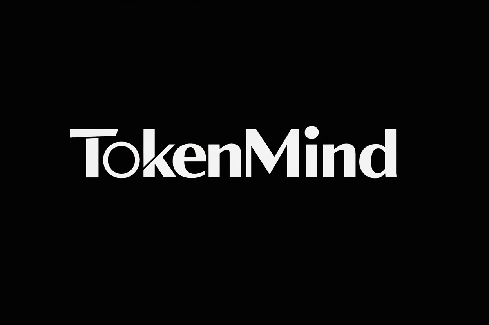
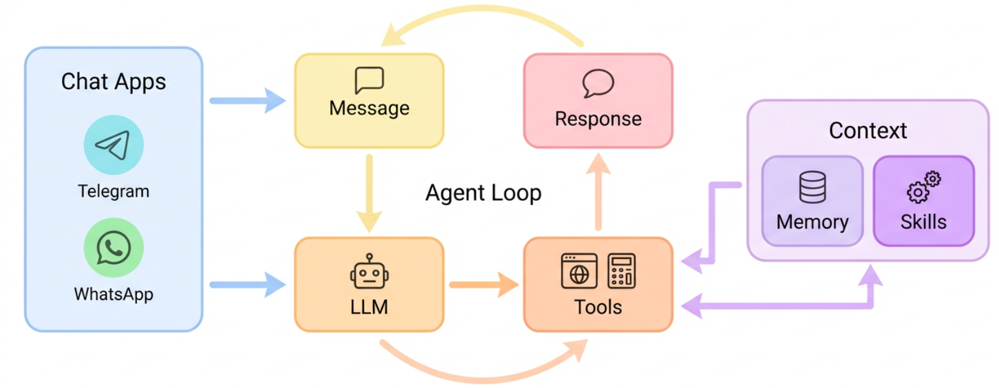

# TokenMind

<p align="center">
  
</p>

<p align="center">
  面向个人与团队的本地优先 AI Agent 工作台，集成聊天、多模型、工具调用、MCP、知识库、记忆系统与 Web 控制台。
</p>

<p align="center">
  
  
  
  
  
  
</p>

## 项目简介

`TokenMind` 是一个本地优先的 AI Agent 框架，目标不是只做一个聊天机器人，而是提供一套可持续扩展的 Agent 运行时与工作台：

- 统一接入多种模型与推理提供商
- 在会话中调用文件、Shell、Web 搜索、MCP 等工具
- 提供知识库、记忆系统、定时任务与文件中心
- 用完整的 Web UI 管理对话、模型、知识库和运行时设置

它适合用来搭建你自己的个人 AI 助手，也适合在团队内做私有化 Agent 工作台。

## 核心能力

- 多模型支持：内置 OpenAI、Anthropic、Gemini、DeepSeek、MiniMax、OpenRouter、Ollama、SiliconFlow、Qwen、GLM、Moonshot 和自定义兼容接口等提供商
- Web 控制台：支持会话管理、流式回复、工具时间线、停止生成、模型切换、知识库链接
- 工具系统：内置 `exec`、文件读写、Web 搜索、定时任务、消息发送、MCP 工具接入
- MCP 集成：支持 `stdio`、`sse`、`streamableHttp` 三类服务
- 知识库：支持多知识库、多文档格式、Embedding、Rerank、混合检索、来源引用
- 记忆系统：包含长期记忆、当前上下文、近期归档与会话持久化
- 审批与审计：支持高风险 `exec` 审批、审计日志与会话级授权

## 架构概览

<p align="center">
  
</p>

核心链路可以概括为：

`Web UI / Channel -> MessageBus -> AgentLoop -> Providers + Tools -> Session / Memory / Knowledge -> WebSocket / Channel Output`

主要由三部分组成：

- Python 后端：负责 Agent 运行时、配置系统、知识库、记忆、会话和 API
- React 前端：负责聊天、设置中心、知识库、记忆中心、文件中心和定时任务
- Node Bridge：负责某些渠道桥接能力，例如 WhatsApp

## 快速开始

### 1. 环境要求

- Python `3.11+`
- Node.js `20+`（源码运行 Web UI、前端开发或 WhatsApp Bridge 需要）
- 推荐使用独立虚拟环境

### 2. 克隆并安装

如果你是从源码运行，建议先创建虚拟环境，避免和系统 Python 里的包互相影响。

**Windows PowerShell**

```powershell
git clone https://gitee.com/sun124578963_0/TokenMind.git
cd TokenMind

py -3.11 -m venv .venv
.\.venv\Scripts\Activate.ps1

python -m pip install -U pip
python -m pip install -e .
```

**macOS / Linux**

```bash
git clone https://gitee.com/sun124578963_0/TokenMind.git
cd TokenMind

python3.11 -m venv .venv
source .venv/bin/activate

python -m pip install -U pip
python -m pip install -e .
```

### 3. 初始化配置

```bash
tokenmind onboard
```

这一步会在 `~/.tokenmind/config.json` 生成默认配置文件。

### 4. 启动 Web UI

这里要分清楚两种运行方式：

- `pip install tokenmind-ai` 安装：前端构建产物已经打包进 Python 包里。
- `git clone` 源码运行：仓库里通常不会提交 `frontend/dist`，所以需要你自己先构建前端。

**方式 A：pip 安装 / 桌面安装包**

```bash
tokenmind web --port 18888
```

然后打开 `http://localhost:18888`。

如果 `18888` 仍然被占用，可以换成任意空闲端口，例如：

```bash
tokenmind web --port 3000
```

此时请打开 `http://localhost:3000`。

**方式 B：源码生产模式，推荐给普通源码使用者**

先构建 React 前端，再让后端 18888 直接托管构建后的页面：

```bash
cd frontend
npm install
npm run build
cd ..

tokenmind web --port 18888
```

然后打开 `http://localhost:18888`。

如果浏览器里看到 `{"detail":"Not Found"}`，通常说明你是源码模式但还没有执行 `npm run build`，或者构建产物没有生成成功。重新执行上面的 `cd frontend && npm install && npm run build` 后再启动 `tokenmind web --port 18888`。

**方式 C：源码开发模式，适合正在改前端**

开发模式需要开两个终端。

终端 1：启动后端和 Agent 服务：

```bash
tokenmind web --port 18888
```

终端 2：启动 Vite 前端开发服务器：

```bash
cd frontend
npm install
npm run dev
```

然后打开 `http://localhost:5173`。Vite 开发服务器会自动代理 API 请求到后端 18888 端口。

如果后端使用了自定义端口，例如 `tokenmind web --port 3000`，前端开发服务器也要指定代理目标：

```bash
# PowerShell
$env:TOKENMIND_API_PROXY="http://localhost:3000"
npm run dev

# cmd
set TOKENMIND_API_PROXY=http://localhost:3000
npm run dev
```

如果还没有配置 API Key，服务仍然会正常启动，但聊天功能暂不可用。

### 5. 配置模型 API Key

打开上一步对应的地址（pip/生产模式为 `http://localhost:18888`，源码开发模式为 `http://localhost:5173`），进入**设置中心**：

1. 在 **Providers** 区域选择你要使用的模型提供商（如 OpenAI、Anthropic、DeepSeek 等）
2. 填入对应的 API Key
3. 在 **Model** 下拉框选择并启用模型
4. 返回聊天页面，即可开始对话

> 也可以直接编辑 `~/.tokenmind/config.json`，在 `providers` 下对应的提供商字段中填入 `api_key`。

### 6. 可选：前端构建

修改前端后，如果想让后端 18888 直接提供最新页面，请重新构建：

```bash
cd frontend
npm install
npm run build
cd ..
tokenmind web --port 18888
```

### 7. 可选：启动网关

如果你想把 Agent 接到 Telegram、飞书等聊天渠道：

```bash
tokenmind gateway
```

### 8. 可选：WhatsApp Bridge

```bash
cd bridge
npm install
npm run build
```

启动后会显示二维码，用 WhatsApp 扫码登录。

## Web 控制台

Web UI 覆盖了日常使用的核心能力：

- 最近会话列表、搜索、重命名、删除
- 流式回复与停止生成
- 工具执行时间线与审批
- 设置中心（模型、提供商、API Key、运行时参数）
- 项目工作区（按项目组织会话）
- 记忆中心
- 定时任务
- 文件中心
- 知识库总览、详情、资料上传、检索配置

## 知识库

`TokenMind` 内置了轻量知识库能力，并且和聊天会话直接打通。

支持的能力包括：

- 新建多个知识库
- 每个知识库上传多种格式资料
- 文档切块、Embedding、Rerank、混合检索
- 聊天输入框下方手动“链接知识库”
- 只在用户主动链接后参与回答
- 回答附来源引用

支持的资料类型包括：

- `pdf`
- `docx`
- `pptx`
- `xlsx`
- `md`
- `txt`
- 图片类资料（依赖解析链）

默认向量后端支持：

- `Qdrant`
- `SQLite`（轻量兜底）

Embedding 与 Rerank 模型支持用户自定义配置。

## 模型与配置

你可以通过两种方式管理模型配置：

- 在 Web UI 的设置中心里直接配置 Provider、模型、API Key 与运行时参数
- 手动编辑 `~/.tokenmind/config.json`

当前常见提供商包括但不限于：

| Provider | 示例模型 |
| --- | --- |
| OpenAI | `gpt-4o` |
| Anthropic | `claude-sonnet-4-5` |
| Gemini | `gemini-2.0-flash` |
| DeepSeek | `deepseek-chat` |
| MiniMax | `MiniMax-M2.7` |
| OpenRouter | `anthropic/claude-sonnet-4-5` |
| Ollama | `llama3.2` |
| SiliconFlow | `Qwen/Qwen2.5-7B-Instruct` |
| Qwen | `qwen-max` |
| GLM | `glm-4` |
| Moonshot | `kimi-k2.5` |
| 自定义 | `default` |

## MCP 支持

`TokenMind` 原生支持 MCP 服务接入，工具会自动注册到 Agent 工具集。

支持的接入方式：

- `stdio`
- `sse`
- `streamableHttp`

接入后会暴露为统一工具名，例如：

```text
mcp_minimax_web_search
mcp_minimax_understand_image
```

你可以在设置中心里：

- 管理 MCP 服务配置
- 限制暴露工具范围
- 查看连通状态
- 刷新并查看工具列表

## 项目结构

```text
TokenMind/
├─ tokenmind/                 # Python 后端主包
│  ├─ agent/                 # Agent 主循环、上下文构建、工具系统
│  ├─ bus/                   # 消息总线与队列
│  ├─ channels/              # 聊天渠道接入
│  ├─ cli/                   # 命令行入口
│  ├─ config/                # 配置模型与加载逻辑
│  ├─ cron/                  # 定时任务
│  ├─ knowledge/             # 知识库与检索
│  ├─ providers/             # 模型提供商实现
│  ├─ server/                # FastAPI、WebSocket、Web channel
│  ├─ session/               # 会话与历史持久化
│  └─ skills/                # 内置技能
├─ frontend/                 # React + Vite Web UI
├─ bridge/                   # Node 渠道桥接服务
├─ tests/                    # 后端测试
├─ README.md
└─ pyproject.toml
```

## 开发

### 后端

```bash
python -m pip install -e ".[dev]"
pytest -q
ruff check tokenmind/
```

### 前端

前端开发时打开 `http://localhost:5173`：

```bash
cd frontend
npm install
npm run dev
```

如果要让 `tokenmind web --port 18888` 直接提供最新页面，需要生成生产构建：

```bash
cd frontend
npm install
npm run build
cd ..
tokenmind web --port 18888
```

### Bridge

```bash
cd bridge
npm install
npm run build
```

## 适合什么场景

`TokenMind` 比较适合这些使用方式：

- 想要一套能长期演进的个人 AI 助手框架
- 想把多模型、多工具、多渠道统一到同一个运行时
- 想做本地优先、私有部署的 Agent 工作台
- 想把知识库、记忆、会话、MCP 和工具链放到一个项目里统一管理

## 文档

- [架构说明](CLAUDE.md)
- [安全说明](SECURITY.md)
- [技能说明](tokenmind/skills/README.md)

## License

MIT
